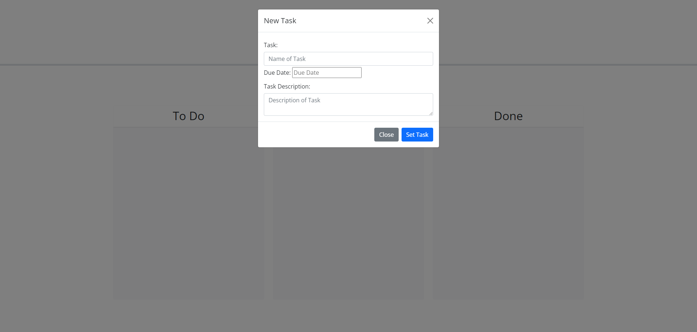
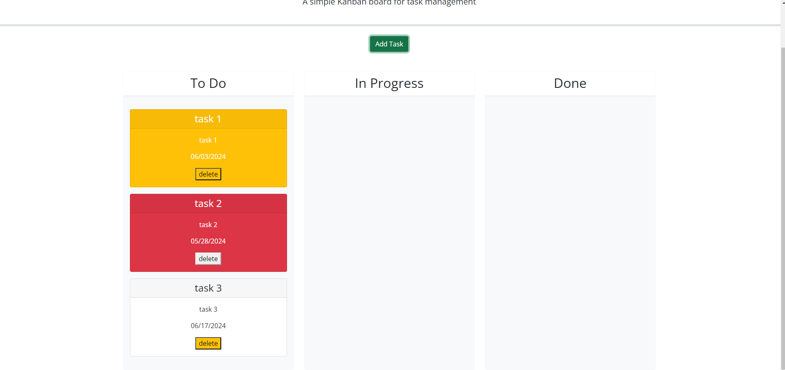

# challenge5-task-board

## Description
This is a web page for logging and tracking tasks that need to be completed. There is a due date in the entry that will trigger color coding to indicate how close you are to the due date

## Usage

For repository: https://github.com/krfrahm/challenge5-task-board.git
For website: https://krfrahm.github.io/challenge5-task-board/index.html

## Credits

This project is soley my work and the provided materials. I also looked at several stack overflow message boards to problem solve with my code. 

I utilized MDN webdocs, Bootstrap, and jqueary for additional functions in this app. I also referenced the week 5 mini project for founctions and assistance in setting logic. 

